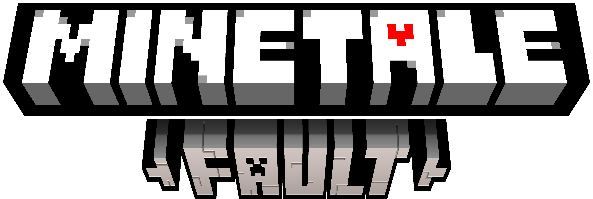
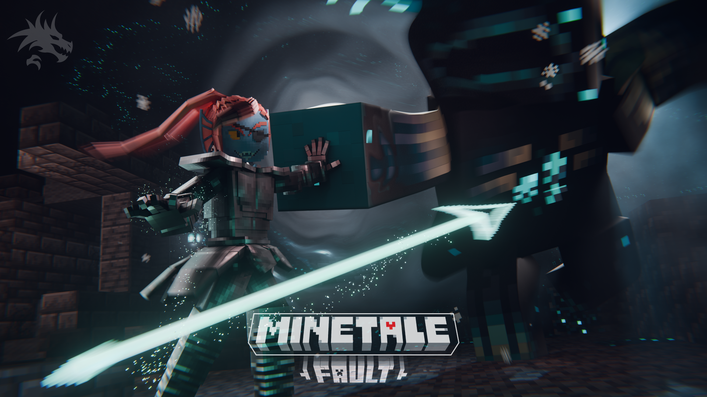
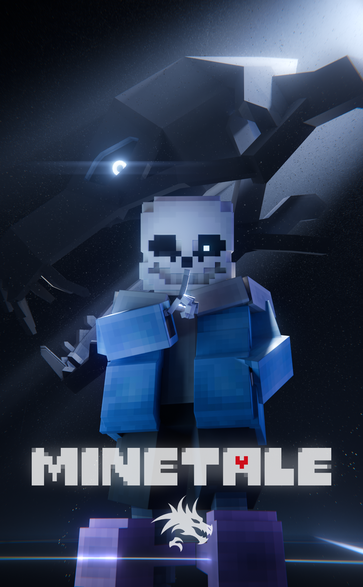
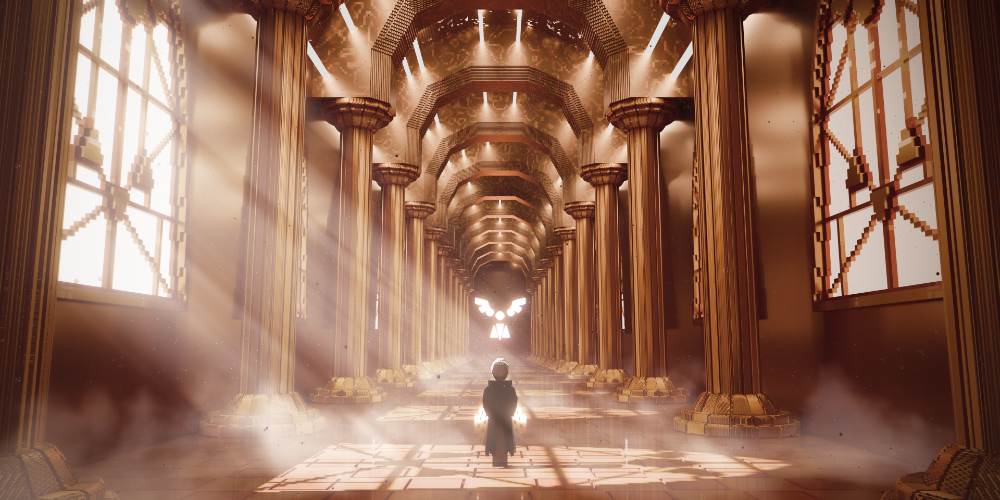
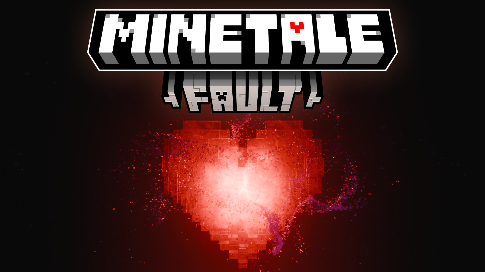

# MINETALE-FAULT

这是一款受Toby Fox的《UNDERTALE》和《DELTARUNE》启发的二创作品，以Minecraft Mod作为主要呈现载体。

通过持续更新，期望成为一部既融合原作特色又具有鲜明个性的作品。

## 目前依赖版本

- Minecraft 1.21.10
- NeoForge 21.10.64
- GeckoLib 5.3-alpha-3

## 许可

项目按内容类别分别授权：公开的自有代码采用 Apache-2.0；原创资产采用 CC BY-NC 4.0，并适用媒体变现附加许可。作品整体及品牌的未授权权利由相应权利人保留，第三方内容遵循各自原始许可。

具体范围及例外见[总许可声明](LICENSE)、[资产声明](ASSET_NOTICES.md)和[借物表](THIRD_PARTY_NOTICES.md)。

## 渲染及宣传海报

 

 

 

