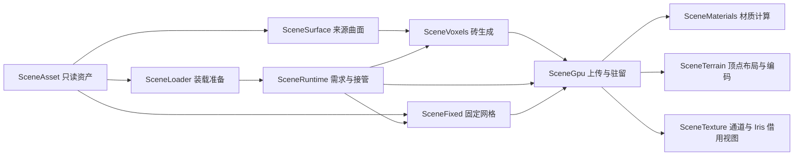

# 场景模块设计

场景输入为 `.mtscene`，输出为 terrain 绘制。Core 的固定 Mesh 全量常驻，由 `SceneFixed` 管理装载与释放；细分组的基础覆盖和近场细节共用场景坐标，在一个空间砖的完整成果就绪后切换覆盖。固定 Mesh 和细分来源在资产中互斥。

## 包边界

`asset` 拥有容器和图像；`geometry` 拥有 CPU 曲面、索引和生成器；`runtime` 拥有客户端生命周期和 GPU。依赖方向为 `runtime → geometry → asset`。各包入口和局部文档见 [asset](../asset/README.md)、[geometry](../geometry/README.md)、[runtime](../runtime/README.md)。

曲面与空间索引共享准备数据和来源关联，调度与 GPU 共享驻留生命周期。这些协作保持包内可见；跨包调用经过资产读取和几何入口。常规构建范围限定为运行时源码。

## 数据流

`SceneClient` 接收客户端命令和世界事件，持有当前场景及加载代次。`SceneLoader` 在工作线程准备资产、图像、Low、截面和目录；加载失败时关闭资产，加载成功时将所有权交给 `SceneRuntime`。客户端负责关闭过期的加载结果。`SceneBase` 和 `SceneBaseCache` 在缺少基础模型时负责生成和持久化。

## 四个核心对象

| 对象 | 拥有的数据 | 生命周期与调用约束 |
|---|---|---|
| `SceneAsset` | ZIP 文件、资源快照、经验证的目录 | 装载时打开，场景释放时关闭；资源快照随资产删除 |
| `SceneSurface` | 来源拓扑、局部细分结果、曲面查询结构、原材质 | 每个场景一份，由工作线程查询并维护曲面缓存 |
| `SceneVoxels` | 同一来源引用、按尺寸复用的工作区、阶段计时 | 每条执行通道独占一份；基础生成拥有独立实例，几何快照与材质输出独立于工作区 |
| `SceneRuntime` | 需求、任务、覆盖、驻留和场景 GPU 资源 | 主线程决定需求与接管，工作线程只生成已捕获的请求；关闭时标记请求失效，CPU 任务实际结束后关闭资产，GPU 按 fence 退休 |

体素工作区属于生成器。每次调用创建局部 `Build`，按“查询 → 保守光栅化 → 暴露面分类 → 矩形合并与截面 → 图集布局 → 采样及顶点输出”的顺序执行。几何阶段输出不可变的 `GeometryResult`，材质阶段根据目标通道输出 `Page`；输出不借用工作区。几何精度、Greedy 与所需截面一致时复用几何快照，材质精度独立重建。

曲面输入验证集中在 `SceneSurface.read`，容器、编码和页验证集中在 `SceneAsset`。`SceneSubdivision` 将来源面集合映射到局部支撑拓扑，再执行细分和 limit 求值；砖需求、显示和 GPU 生命周期由上层运行时负责。

## 空间页与空间砖

资产页是 IO 单位，`SceneLayout.Cell` 和空间尺寸定义生成范围。体素生成直接接收坐标及空间尺寸，资产页 ID 和页内三角形数量属于 IO 层数据。

`SceneLayout` 保存完整 Low 及按砖裁切后的覆盖。`SceneIndex` 保存页、砖、来源关联和截面入口；静态索引和运行时生成目录分别使用各自的 Low。`SceneLowVolume` 与 `SceneVisibility` 为离线索引提供占用和连通信息。曲面求值、体素化和索引预处理共享生产算法。

## 接管与资源状态

`SceneRuntime` 分别维护需求、生成完成和当前显示状态。离开需求范围的附近成果继续驻留，High 进入距离两倍以外（Raw 为 192 米）且无在途任务的闲置成果分帧回收；仅 `wanted && ready` 的成果参与接管。邻砖接管发生变化时，运行时只使所属页和邻接页的绘制缓存失效。

每个任务捕获生成代次、单砖版本、精度、Greedy 设置和所需截面。工作线程在固定检查点观察取消；渲染线程收集结果、分批上传并等待 GPU fence，再发布就绪状态。空 High 也可以就绪，用于表示该区域的来源表面为空。失败砖保留 Low。

调度顺序为更新需求、回收远处闲置成果、收集并推进任务、提交新任务、绘制。运行时统一管理候选排序、随几何精度扩展的距离滞回、取消和覆盖切换；每帧检查有限个驻留成果，回收最多两砖。完整条件见 [CONTEXT.md](../CONTEXT.md)。

## GPU 边界

`SceneGpu` 拥有 Low 缓冲、High 上传和共享图集；最后一块砖的退休 fence 完成后回收对应图集。已退休的顶点缓冲与材质 SSBO 按容量复用，两类空闲池各最多四份、各最多 32 MiB。`SceneMaterials` 拥有 compute program 和分批烘焙，按输入传输、采样求值、图集散布、mip 的顺序推进，并在每次推进后恢复原始 GL 状态。

`SceneTerrain` 同时声明顶点属性和编码布局，维护普通 terrain 与 Iris 扩展字段的顺序。它只编码调用方提供的 UV 比例和偏移；场景缓冲和图集由 `SceneGpu`、`SceneTexture` 拥有。`SceneTexture` 拥有纹理，Iris holder 借用其 GPU 通道。

## 修改入口

- 改变档位或需求选择：修改 `SceneRuntime`；几何结果由 `SceneVoxels` 生成。
- 改变来源解析或曲面求值：修改 `SceneSurface`、`SceneSubdivision`、`SceneSourceMaterials`。
- 改变体素占用、合并或采样：修改 `SceneVoxels` 对应阶段。
- 改变材质计算：修改 `SceneMaterials` 和 shader；生成后的二进制布局见文件与纹理契约。
- 改变 terrain 属性：同时修改 `SceneTerrain` 的声明和编码，并验证原版/Iris 两种布局。
- 改变导入格式：修改 `SceneAsset`、导出工具及[文件契约](../asset/docs/mtscene-format.md)。

生成缓存分为几何、颜色及完整资产三个域，键由相关来源、shader 依赖和显式算法版本构成。修改生成算法或缓存布局时同步递增所属域版本；缓存规则见[基础 LOD 缓存](../runtime/docs/base-lod-cache.md)。
